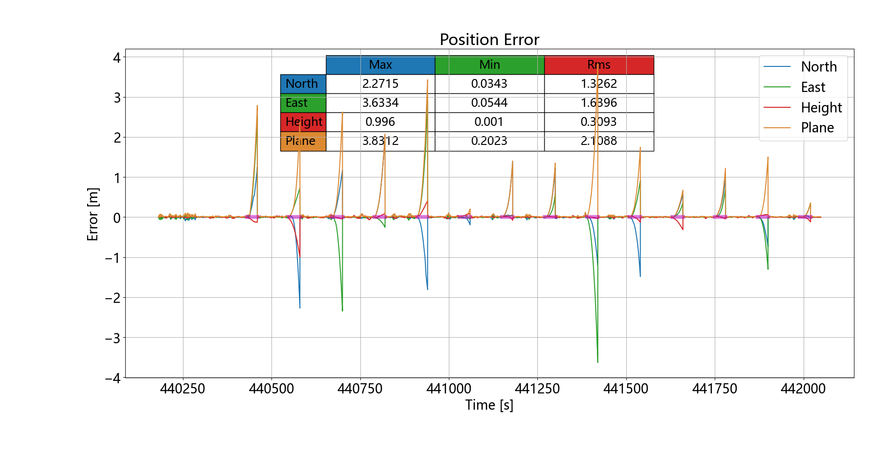
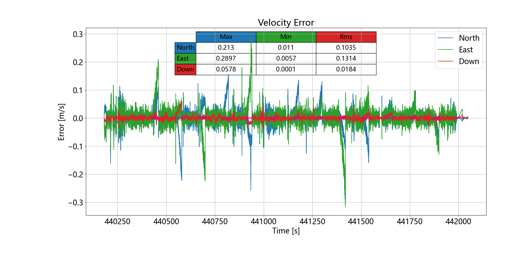
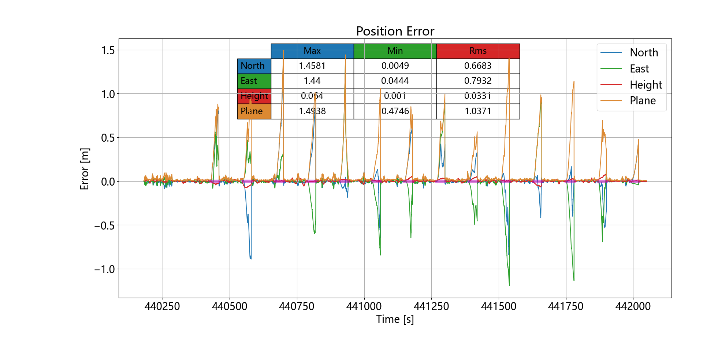
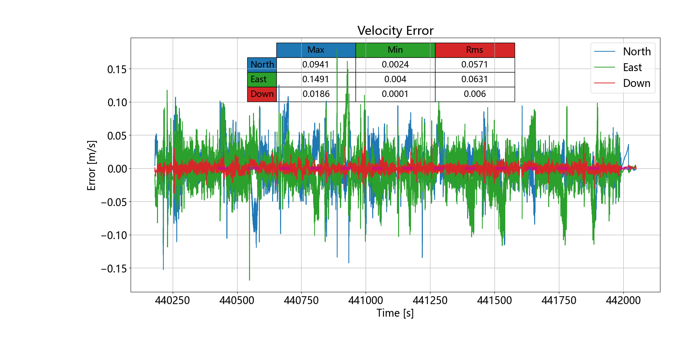
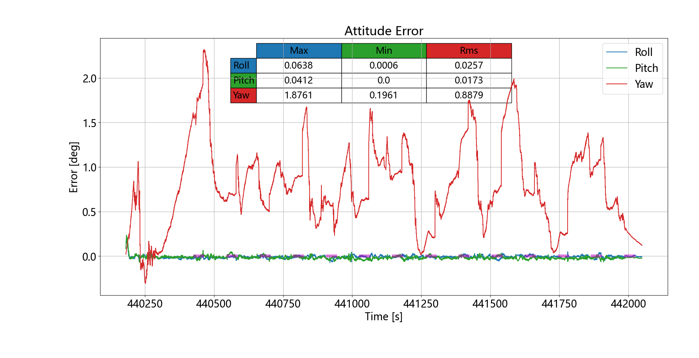
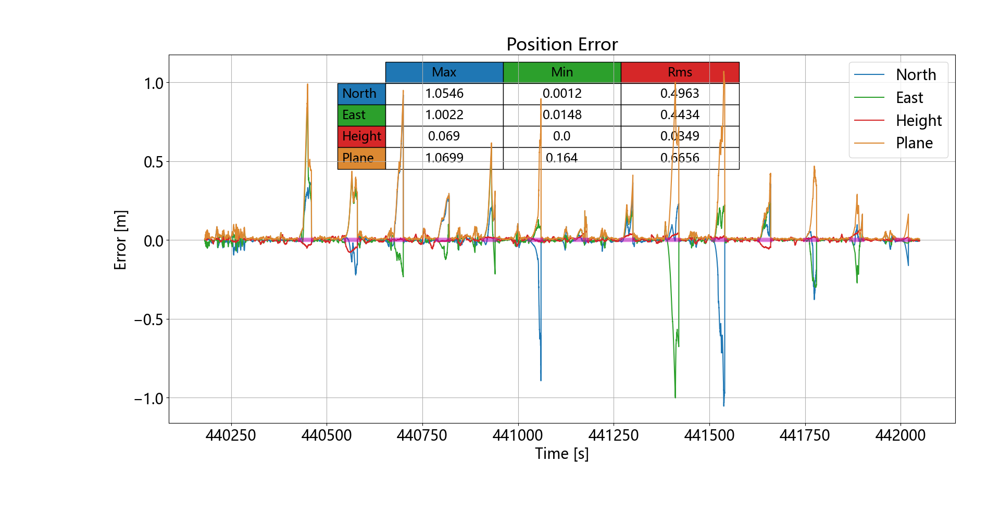
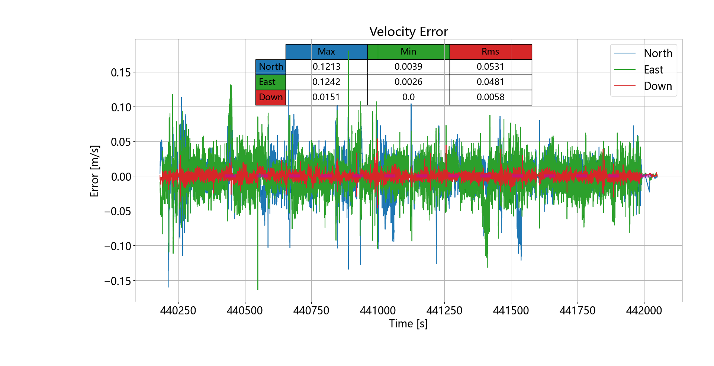
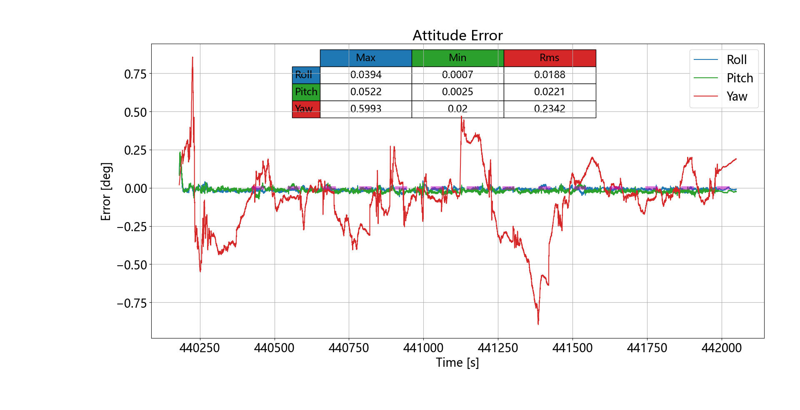
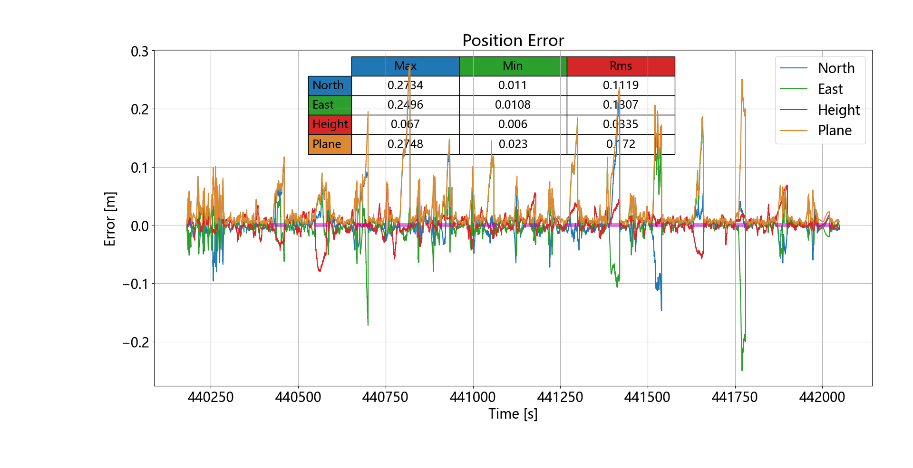
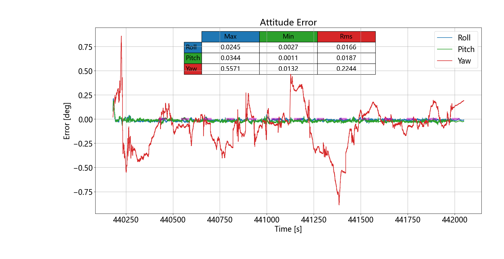

## Introduction

This project contains source code and a demo of my article <GNSS/INS/ODO/Wheel Angle Integrated Navigation Algorithm for an All-Wheel Steering Robot>. The demo is about experiment 2 in the article. You can set the value of macro definiti on in "src/lcdefine.h" to get the result of 4 cases.

Mode #1: USE_ODO=0,USE_STEER=0

Mode #2: USE_ODO=0,USE_STEER=1

Mode #3: USE_ODO=0,USE_STEER=2

Mode #4: USE_ODO=1,USE_STEER=2


## How to run?

```bash
git clone https://github.com/i2Nav-WHU/GIOW-release.git
# (In China) git clone https://gitee.com/forcazzx/GIOW-release.git
cd GIOW-release
mkdir build
cd build
cmake ..
make
# run the executable and wait a moment
```


## Algorithm flowchart


## Result

After running the executable, you can get "my_result.nav" and "system_error_state.txt" in the "data" folder. "my_result.nav" is the result of the project, which has 11 columns of data as follows.

| useless | sow(s) | latitude(deg) | longitude(deg) | height(m) | vel_north(m/s) | vel_east(m/s) | vel_down(m/s) | roll(deg) | pitch(deg) | yaw(deg) |
| ------- | ------ | ------------- | -------------- | --------- | -------------- | ------------- | ------------- | --------- | ---------- | -------- |

"system_error_state" is the error state estimation of this project, which has 24 columns of data as follows (vectors are denoted in italic letters).

| sow(s) | *pos_err*(m) | *vel_err*(m/s) | *att_err*(rad) | *gyro_bias*(rad/s) | *gyro_scale_factor* | *acce_bias*(m/s^2) | *acce_scale_factor* | odo_scale_factor | wheel_angle_err(deg) |
| ------ | -------------- | ---------------- | ---------------- | -------------------- | --------------------- | -------------------- | --------------------- | ---------------- | -------------------- |

"reference_result.nav" is the reference, the format of which is as same as "my_result.nav". You can get the navigation error by comparing "my_result.nav" and "reference_result.nav". We get the navigation error of 4 cases in experiment 2 and plot them, as shown in "result" folder. The file "*.err" is the navigation error, which has 10 columns of data as follows (vectors are denoted in italic letters).

| sow(s) | *pos_err*(m) | *vel_err*(m/s) | *att_err*(deg) |
| ------ | ------------ | -------------- | -------------- |

### mode #1





### mode #2





### mode #3





### mode #4




